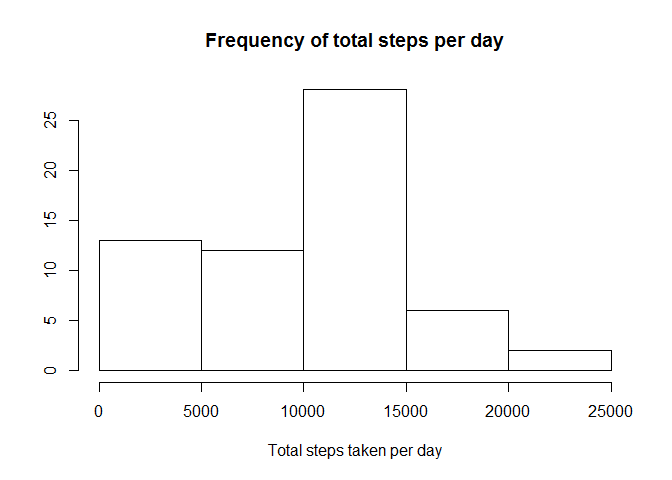
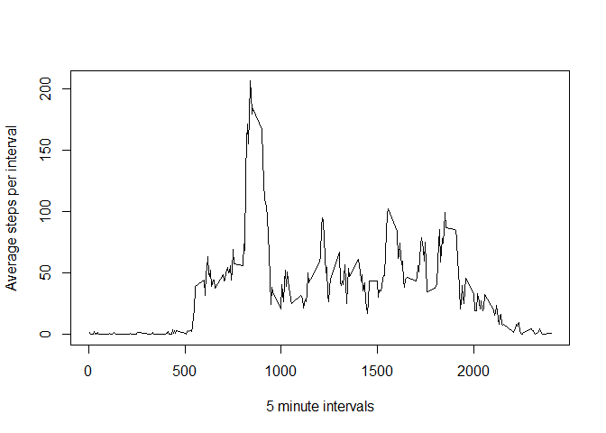
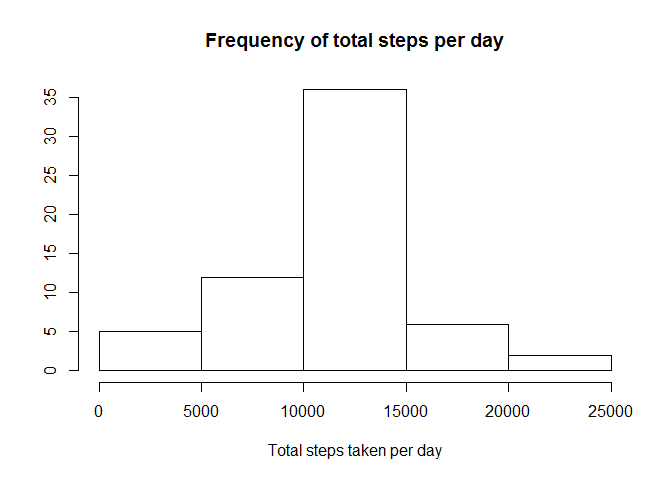
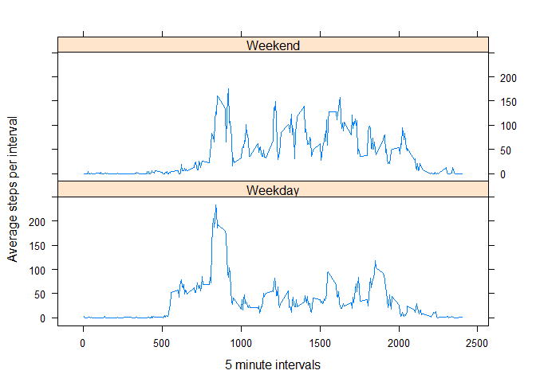

# Reproducible Research Course
## Assignment 1

Installing required packages if needed:

```
## 
## Attaching package: 'dplyr'
```

```
## The following objects are masked from 'package:stats':
## 
##     filter, lag
```

```
## The following objects are masked from 'package:base':
## 
##     intersect, setdiff, setequal, union
```

Loading data into R:


```r
URL <-"https://d396qusza40orc.cloudfront.net/repdata%2Fdata%2Factivity.zip"
download.file (URL, destfile= "./zip_file.zip", mode="wb")
unzip ("zip_file.zip")
mydata <- read.csv ("activity.csv")
summary (mydata)
```

```
##      steps                date          interval     
##  Min.   :  0.00   2012-10-01:  288   Min.   :   0.0  
##  1st Qu.:  0.00   2012-10-02:  288   1st Qu.: 588.8  
##  Median :  0.00   2012-10-03:  288   Median :1177.5  
##  Mean   : 37.38   2012-10-04:  288   Mean   :1177.5  
##  3rd Qu.: 12.00   2012-10-05:  288   3rd Qu.:1766.2  
##  Max.   :806.00   2012-10-06:  288   Max.   :2355.0  
##  NA's   :2304     (Other)   :15840
```


Total of steps taken per day calculation and its histogram:


```r
mydata$date <- as.Date(mydata$date)

total_steps_per_day <- mydata %>% group_by(date) %>% summarise(sum_steps=sum(steps, na.rm = TRUE))

head (total_steps_per_day)
```

```
## # A tibble: 6 x 2
##   date       sum_steps
##   <date>         <int>
## 1 2012-10-01         0
## 2 2012-10-02       126
## 3 2012-10-03     11352
## 4 2012-10-04     12116
## 5 2012-10-05     13294
## 6 2012-10-06     15420
```

```r
png("Fig1.png")
fig1 <- hist (total_steps_per_day$sum_steps, xlab="Total steps taken per day", ylab="", main="Frequency of total steps per day")
dev.off()
```

```
## png 
##   2
```

```r
plot (fig1)
```

<!-- -->

Median and mean values for total steps taken per day:

```r
total_steps_per_day %>% summarise (mean_tspd =mean (sum_steps, na.rm=TRUE), median_tspd = median (sum_steps, na.rm=TRUE))
```

```
## # A tibble: 1 x 2
##   mean_tspd median_tspd
##       <dbl>       <int>
## 1     9354.       10395
```

Time series plot for total steps per interval:

```r
five_min_interval <- format( seq.POSIXt(as.POSIXct(Sys.Date()), as.POSIXct(Sys.Date()+1), by = "5 min"), "%H%M", tz="GMT")
five_min_interval <- five_min_interval [-1]
five_min_interval [288] <- "2400"


steps_groupedby_interval <- mydata %>% group_by(date) %>% mutate (interval=five_min_interval)
steps_groupedby_interval_averaged <- steps_groupedby_interval %>% group_by(interval) %>% summarise(average_intervalled=mean (steps, na.rm=TRUE))
head (steps_groupedby_interval_averaged)
```

```
## # A tibble: 6 x 2
##   interval average_intervalled
##   <chr>                  <dbl>
## 1 0005                  1.72  
## 2 0010                  0.340 
## 3 0015                  0.132 
## 4 0020                  0.151 
## 5 0025                  0.0755
## 6 0030                  2.09
```

```r
fig2 <- plot (x=steps_groupedby_interval_averaged$interval, y=steps_groupedby_interval_averaged$average_intervalled, type="l", xlab= "5 minute intervals", ylab ="Average steps per interval", xlim =c(0005,2400))
```

<!-- -->

The interval in which the maximum average number of steps is recorded.

```r
steps_groupedby_interval_averaged$interval[which.max(steps_groupedby_interval_averaged$average_intervalled)]
```

```
## [1] "0840"
```

Missing values:


```r
total_NA <- sum (is.na (mydata [, "steps"]))
total_NA
```

```
## [1] 2304
```

Replacing NAs using the average cacluated fr each interval:


```r
na_replaced <- replace (steps_groupedby_interval$steps, is.na (steps_groupedby_interval$steps), steps_groupedby_interval_averaged$average_intervalled)

steps_groupedby_interval$steps_na_replaced <- na_replaced
head (steps_groupedby_interval)
```

```
## # A tibble: 6 x 4
## # Groups:   date [1]
##   steps date       interval steps_na_replaced
##   <int> <date>     <chr>                <dbl>
## 1    NA 2012-10-01 0005                1.72  
## 2    NA 2012-10-01 0010                0.340 
## 3    NA 2012-10-01 0015                0.132 
## 4    NA 2012-10-01 0020                0.151 
## 5    NA 2012-10-01 0025                0.0755
## 6    NA 2012-10-01 0030                2.09
```

Calculating the total number of steps taken per day after replacing the NAs as well as mean adn median:


```r
total_steps_per_day_2 <- steps_groupedby_interval %>% group_by(date) %>% summarise(sum_steps_2=sum(steps_na_replaced))
head (total_steps_per_day_2)
```

```
## # A tibble: 6 x 2
##   date       sum_steps_2
##   <date>           <dbl>
## 1 2012-10-01      10766.
## 2 2012-10-02        126 
## 3 2012-10-03      11352 
## 4 2012-10-04      12116 
## 5 2012-10-05      13294 
## 6 2012-10-06      15420
```

```r
fig3 <- hist (total_steps_per_day_2$sum_steps_2, xlab="Total steps taken per day", ylab="", main= "Frequency of total steps per day")
```

<!-- -->

```r
total_steps_per_day_2 %>% summarise (mean_tspd2 =mean (sum_steps_2), median_tspd2 = median (sum_steps_2))
```

```
## # A tibble: 1 x 2
##   mean_tspd2 median_tspd2
##        <dbl>        <dbl>
## 1     10766.       10766.
```

The mean and median both seems to be increasing. The reason could be due to the fact that in the first round we were omitting the NAs from the calculation, however, now they have a value which is equal to the average number of steps for each interval. This will skew the result to have a higher mean value.

Comparing the activity pattern on weekdays versus weekends:


```r
steps_groupedby_interval$weekday <- weekdays (steps_groupedby_interval$date)

steps_groupedby_interval$weekday.type <- ifelse(steps_groupedby_interval$weekday == "Saturday" | steps_groupedby_interval$weekday == "Sunday", "Weekend", "Weekday")
steps_groupedby_interval$weekday.type <- factor (steps_groupedby_interval$weekday.type)
head (steps_groupedby_interval)
```

```
## # A tibble: 6 x 6
## # Groups:   date [1]
##   steps date       interval steps_na_replaced weekday weekday.type
##   <int> <date>     <chr>                <dbl> <chr>   <fct>       
## 1    NA 2012-10-01 0005                1.72   Monday  Weekday     
## 2    NA 2012-10-01 0010                0.340  Monday  Weekday     
## 3    NA 2012-10-01 0015                0.132  Monday  Weekday     
## 4    NA 2012-10-01 0020                0.151  Monday  Weekday     
## 5    NA 2012-10-01 0025                0.0755 Monday  Weekday     
## 6    NA 2012-10-01 0030                2.09   Monday  Weekday
```


```r
steps_groubedBy_interval_weekday <- steps_groupedby_interval %>% group_by (interval, weekday.type) %>% summarise(mean_sgiw = mean (steps, na.rm =TRUE))


steps_groubedBy_interval_weekday$interval <- as.numeric(as.character(steps_groubedBy_interval_weekday$interval))

fig4 <- xyplot (mean_sgiw ~ interval|weekday.type, steps_groubedBy_interval_weekday, type= "l", layout = c(1, 2), xlab = "5 minute intervals", ylab = "Average steps per interval")
fig4
```

<!-- -->

